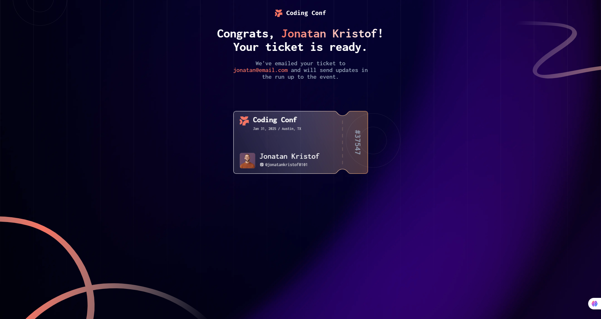

# Frontend Mentor - Conference Ticket Generator Solution

This is a solution to the [Conference ticket generator challenge on Frontend Mentor](https://www.frontendmentor.io/challenges/conference-ticket-generator-oq5gFIU12w).

## Table of Contents

- [Overview](#overview)
  - [The Challenge](#the-challenge)
  - [Screenshots](#screenshots)
  - [Links](#links)
  - [Features](#features)
- [My Process](#my-process)
  - [Built With](#built-with)
  - [What I Learned](#what-i-learned)
- [Installation & Setup](#installation--setup)
- [Project Structure](#project-structure)
- [Author](#author)

## Overview

### The Challenge

Users should be able to:

- ✅ Complete the form with their details
- ✅ Receive form validation messages if:
  ✅ Any field is missed
  ✅ The email address is not formatted correctly
  ✅ The avatar upload is too big or the wrong image format
- ✅ Complete the form only using their keyboard
- ✅ Have inputs, form field hints, and error messages announced on their screen reader
- ✅ See the generated conference ticket when they successfully submit the form
- ✅ View the optimal layout for the interface depending on their device's screen size
- ✅ See hover and focus states for all interactive elements on the page

### Screenshots

**Desktop Form Page**


**Mobile Form Page**


**Desktop Ticket Page**


**Mobile Ticket Page**


### Links

- Live Site URL: https://ticket-generator-eight-cyan.vercel.app/
- GitHub Repo: https://github.com/chizzy192/ticket-generator.git

### Features

- **Dynamic Ticket ID Generation**: Each submission generates a unique ticket ID in the format `#01609`
- **Real-time Form Validation**: Email format validation with instant feedback
- **Accessible Form Controls**: Full keyboard navigation support and screen reader compatibility
- **Image Upload**: Drag-and-drop or click-to-upload avatar with file size validation (max 500KB)
- **Visual Error Messages**: Custom styled error indicators with icon and orange color
- **Responsive Design**: Mobile-first approach with desktop optimization
- **Route Protection**: Automatic redirect to form if user tries to access ticket page without data

## My Process

### Built With

- **React 19.2.0** - UI library
- **TypeScript** - Type safety and better DX
- **Vite** - Fast build tool and dev server
- **React Router DOM** - Client-side routing
- **Zustand** - Lightweight state management
- **CSS with Custom Properties** - Flexible, maintainable styling
- **Flexbox & Grid** - Modern layout techniques

### What I Learned

#### 1. **State Management with Zustand**
Implemented lightweight global state management for form data:
```typescript
export const useFormStore = create<FormStore>((set) => ({
  id: '',
  fullName: '',
  email: '',
  emailError: '',
  updateField: (field: keyof FormData, value: any) => 
    set(() => ({ [field]: value })),
  setEmailError: (error: string) => set({ emailError: error }),
}));
```

#### 2. **Form Validation & Error Handling**
Built comprehensive validation logic with real-time error clearing:
```typescript
const emailRegex = /^[^\s@]+@[^\s@]+\.[^\s@]+$/;
if (!emailRegex.test(trimmedEmail)) {
  setEmailError("Please enter a valid email address");
}
```

#### 3. **Accessibility (a11y)**
Implemented ARIA labels, error descriptions, and semantic HTML:
```tsx
<input 
  aria-invalid={error ? 'true' : 'false'}
  aria-describedby={errorId}
/>
```

#### 4. **React Router Protected Routes**
Protected the ticket page with validation checks:
```typescript
useEffect(() => {
  if (!fullName || !fullName.trim()) {
    navigate('/', { replace: true });
  }
}, [navigate, fullName]);
```

#### 5. **File Handling & Image Preview**
Implemented drag-and-drop file handling with preview:
```typescript
const reader = new FileReader();
reader.onloadend = () => {
  setImagePreview(reader.result as string);
};
reader.readAsDataURL(file);
```

## Installation & Setup

### Prerequisites
- Node.js 16+ and npm

### Steps

1. **Install dependencies**
```bash
npm install
```

2. **Run development server**
```bash
npm run dev
```
The app will be available at `http://localhost:5173`

3. **Build for production**
```bash
npm run build
```

4. **Preview production build**
```bash
npm run preview
```

## Project Structure

```
src/
├── components/
│   ├── formInput/          # Reusable form input component with error display
│   ├── imageInput/         # Image upload with drag-and-drop
│   ├── header/             # Page header component
│   └── backgroundImage.tsx # Background decorative component
├── pages/
│   ├── ticketform/         # Form submission page
│   └── ticketdesign/       # Generated ticket display page
├── store/
│   └── useFormStore.ts     # Zustand state management
├── assets/
│   ├── fonts/              # Custom fonts (Inconsolata)
│   └── images/             # SVG and PNG assets
├── App.tsx                 # Main app with routing
└── main.tsx                # Entry point
```

## Technologies Used

| Technology | Version | Purpose |
|-----------|---------|---------|
| React | 19.2.0 | UI Framework |
| TypeScript | ~5.9.3 | Type Safety |
| Vite | 7.2.4 | Build Tool |
| React Router DOM | Latest | Client Routing |
| Zustand | Latest | State Management |
| ESLint | 9.39.1 | Code Quality |

## Browser Support

- Chrome/Edge (latest)
- Firefox (latest)
- Safari (latest)
- Mobile browsers (iOS Safari, Chrome Mobile)

## Future Enhancements

- [ ] Backend integration for ticket persistence
- [ ] Email verification system
- [ ] Ticket download as PDF
- [ ] QR code generation for tickets
- [ ] User account system
- [ ] Ticket sharing functionality
- [ ] Dark mode toggle

---

## Author

- Website - [Chiziterem Eze](https://chiziteremeze.vercel.app/)
- Frontend Mentor - [@chizzy192](https://www.frontendmentor.io/profile/chizzy192)
- Twitter - [@ezechiziterem](https://www.twitter.com/ezechiziterem)

---

**Have fun building!** 🚀
